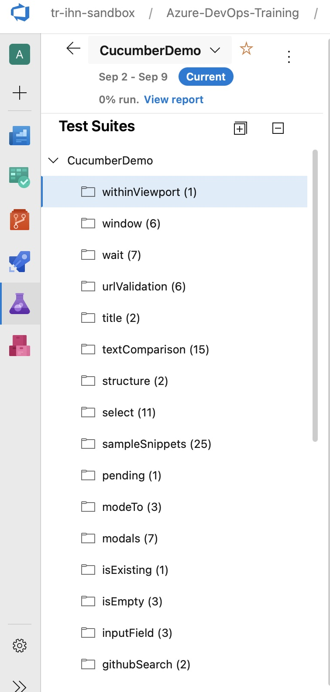

## Sample Screenshots:
### Screenshot of Feature File before running this GH Action.

### Screenshots of Azure DevOps After running this GH Action.

### Screenshots of Outline Scenario with parameters populated in to Paramater Column in ADO Test Case

### Screenshots of test cases with automatically linked to user story and bug

### Screenshots of cucumber-ado-sync branch 

### Screeshots of Features autopopulated with ADO Test Case ID as Tag (in cucumber-ado-sync branch )

### Screenshos after running Test Results GH Action

