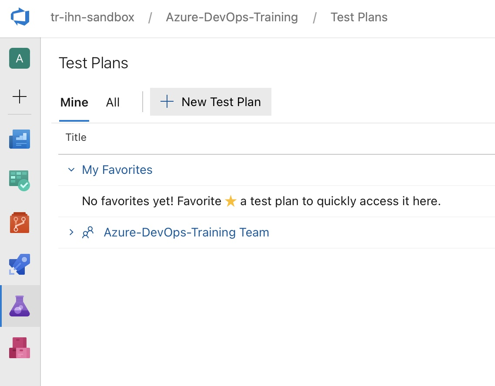
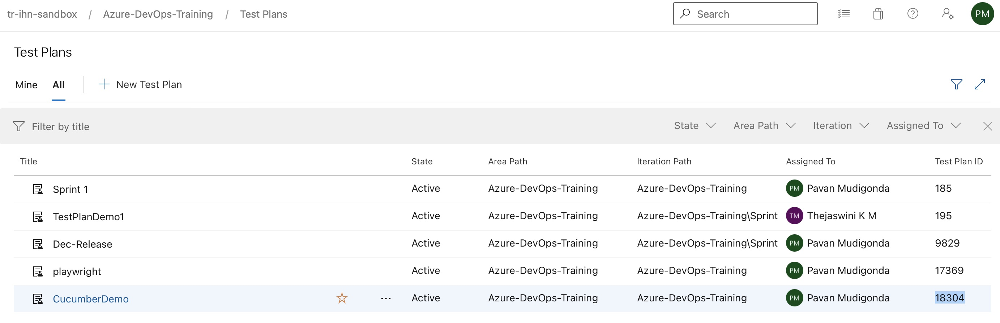
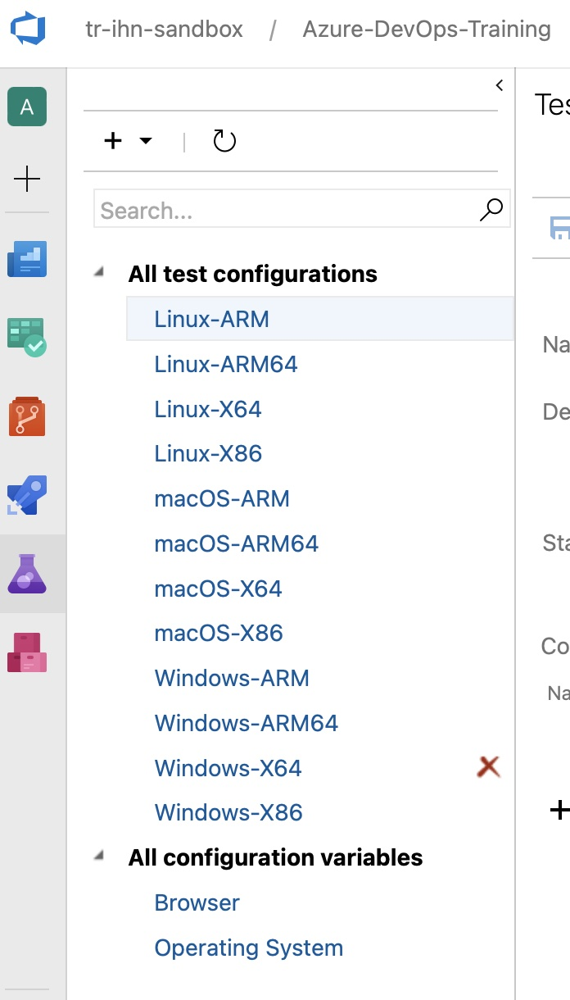
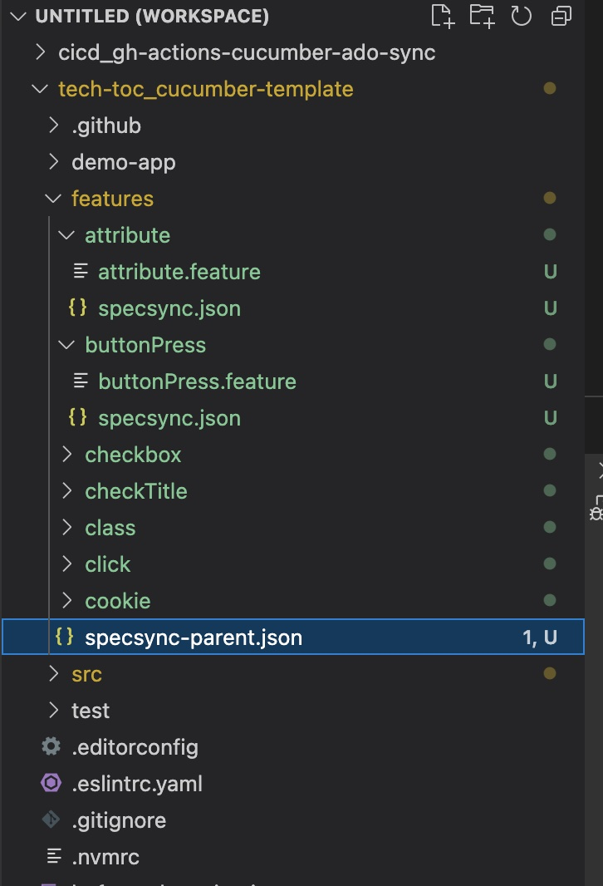
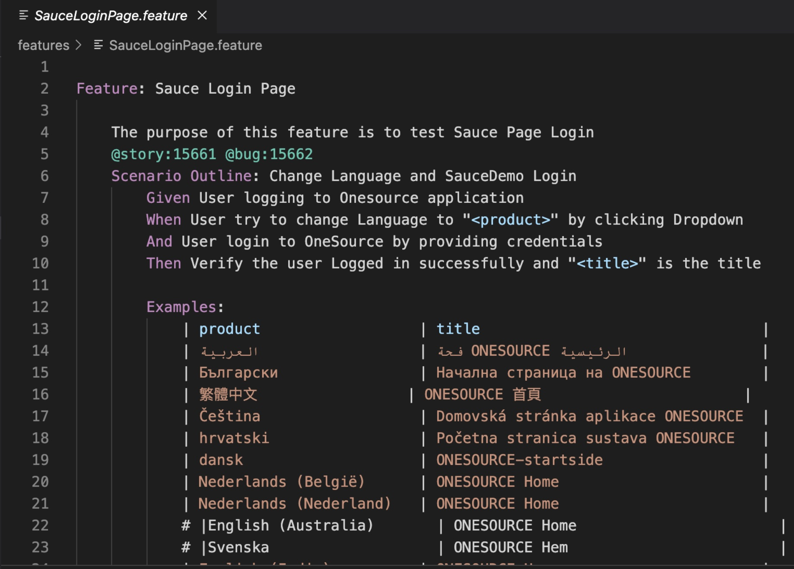

## 1. Create TestPlan

First Create TestPlan ID and make note of the Test Plan ID.
Step# 1

Step# 2

Step# 3

## 2. ADO Test Configuration

We need to create test configuration to define Operating System the test will be running on. This will be used in Parent Level Configuration File.

## 3. Organize Folder Structure
First, we need to organize the folder structure of the feature the way we want to see them in ADO Test Plan. Each folder will provision one test suite under specified TestPlan.

## 4. Configuration Files

-   **Parent configuration files** Parent config file needs to be located at the Root of your features folder name "specsync-parent.json". This config has config variables which are common for whole project. We have a [template specsync-common.json](./specsync-templates/parent-level/specsync-parent.json) that you can copy and make changes. [Reference Documentation Located at](https://specsolutions.gitbook.io/specsync/features)
-   **Feature File Level (Child) configuration files** Feature File Level configuration files need to be located at Feature level and has definitions for only feature level specific config. For example if you have different Test Suites for each Feature File.We have a [template specsync-common.json](./specsync-templates/child-level/specsync.json) that you can copy and make changes. [Reference Documentation Located at](https://specsolutions.gitbook.io/specsync/features)

Step# 4

## 5. Tag User Story and/or Bug Number

- Its recommend you enter user story number as Tag for each scenario in feature files in format @story:XXXX. If you do this we create link between user story and test cases automatically!
- If you would like to upload a attachment for each test cases. for example if you want to upload json request and expected json response for a test case. you can add tag attachment: TC1_request.json attachment: TC1_expected_response.json
- It would be lot easier if you add each tag in a separate line so its clean to understand.
- First you need to create Test Plan and a Test Suite.
- If you create test cases for testing a bug fix, then add Tag in format @bug:XXXX. This will link your test cases with respective bug fix id.

## 6. Create GitHub Teams
This Action creates a PR with updated Cucumber Feature Files with Azure DevOps Work Item Tag#. So we suggest you to do the following to enable auto assignment of PR to your team members.
- You should create GitHub Teams and enable PR Assignment Rules. Refer [GitHub Teams](https://docs.github.com/en/organizations/organizing-members-into-teams/managing-code-review-settings-for-your-team)
- You should [link your repo to your GitHub Team](https://docs.github.com/en/repositories/managing-your-repositorys-settings-and-features/managing-repository-settings/managing-teams-and-people-with-access-to-your-repository)
