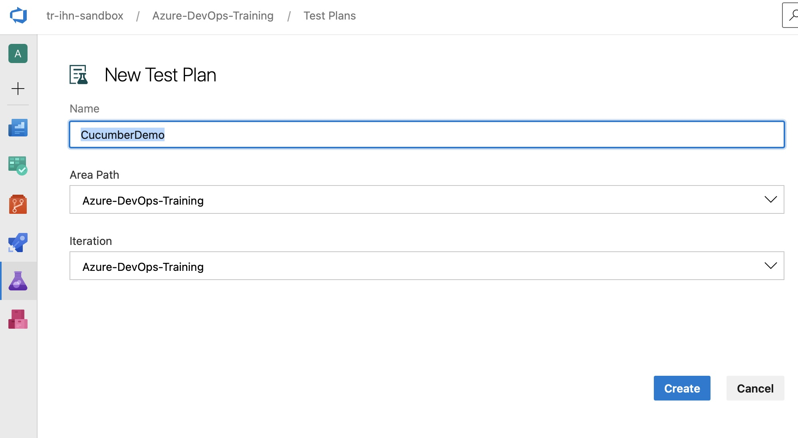

## 1. Create ADO BOT ACCOUNT

You can create a BOT account using these instructions. This gives you a service account with an email address and you can use it for things like Azure DevOps access. You'll receive a TR employee ID (e.g. C1234567) and you can use MFA with it, just like your standard TR account. BOT accounts belong to a single TR employee. I don't know if their ownership can be transferred if the employee leaves. The owner of a BOT account has to renew the "contract" for the account every 60 days. 

You can also create a service account [link1](https://identity.int.thomsonreuters.com/documents/Request_Service_account_and_functionalities.pdf), [link2](https://identity.int.thomsonreuters.com/content/topics/governance/page/non_standard_account_management) where you and another person own the account, and the ownership can change if someone leaves the team or the company. This is more flexible than BOT accounts but is more work to set up. My team has a service account with me as the owner and my manager as the co-owner. If either of us leave the team/company, the other can manage the account and transfer co-ownership. I have not used this service account with ADO, so I don't know if there are any limitations. 

>NOTE: You can skip this step if you decide to use your (one of your teammate) existing user account for the Basic + TestPlan access

## 2. Give your BOT Basic + TestPlans Access

If you do not have Azure DevOps Organization setup for your team, refer the [Azure DevOps - Getting Access](https://github.com/tr/tech-toc_live/blob/main/content/non-functional/strategy-planning/work-item-tracking/azure-devops)

If you already have Azure DevOps Organization setup for your team, please talk to your ADO Org Owner to get "Basic + Test Plans" access for your newly created ADO BOT.

>NOTE: You have choice to use BOT Account or an existing user account for the Basic + TestPlan access

## 3. Create ADO PAT Token on GitHub Repo
- First obtain [ADO PAT Token](https://learn.microsoft.com/en-us/azure/devops/organizations/accounts/use-personal-access-tokens-to-authenticate?view=azure-devops&tabs=Windows)
- [Adding secrets for a repository](https://docs.github.com/en/codespaces/managing-codespaces-for-your-organization/managing-encrypted-secrets-for-your-repository-and-organization-for-github-codespaces#adding-secrets-for-a-repository)
- [Adding secrets for an organization](https://docs.github.com/en/codespaces/managing-codespaces-for-your-organization/managing-encrypted-secrets-for-your-repository-and-organization-for-github-codespaces#adding-secrets-for-an-organization)

## 4. Create TestPlan

First Create TestPlan ID and make note of the Test Plan ID.
Step# 1

Step# 2

Step# 3

## 5. ADO Test Configuration

We need to create test configuration to define Operating System the test will be running on. This will be used in Parent Level Configuration File.

## 6. Organize Folder Structure
First, we need to organize the folder structure of the feature the way we want to see them in ADO Test Plan. Each folder will provision one test suite under specified TestPlan.

## 7. Configuration Files

-   **Parent configuration files** Parent config file needs to be located at the Root of your features folder name "specsync-parent.json". This config has config variables which are common for whole project. We have a [template specsync-common.json](./specsync-templates/parent-level/specsync-parent.json) that you can copy and make changes. [Reference Documentation Located at](https://specsolutions.gitbook.io/specsync/features)
-   **Feature File Level (Child) configuration files** Feature File Level configuration files need to be located at Feature level and has definitions for only feature level specific config. For example if you have different Test Suites for each Feature File.We have a [template specsync-common.json](./specsync-templates/child-level/specsync.json) that you can copy and make changes. [Reference Documentation Located at](https://specsolutions.gitbook.io/specsync/features)

Step# 4

## 8. Tag User Story and/or Bug Number

- Its recommend you enter user story number as Tag for each scenario in feature files in format @story:XXXX. If you do this we create link between user story and test cases automatically!
- If you would like to upload a attachment for each test cases. for example if you want to upload json request and expected json response for a test case. you can add tag attachment: TC1_request.json attachment: TC1_expected_response.json
- It would be lot easier if you add each tag in a separate line so its clean to understand.
- First you need to create Test Plan and a Test Suite.
- If you create test cases for testing a bug fix, then add Tag in format @bug:XXXX. This will link your test cases with respective bug fix id.

## 9. Create GitHub Teams
This Action creates a PR with updated Cucumber Feature Files with Azure DevOps Work Item Tag#. So we suggest you to do the following to enable auto assignment of PR to your team members.
- You should create GitHub Teams and enable PR Assignment Rules. Refer [GitHub Teams](https://docs.github.com/en/organizations/organizing-members-into-teams/managing-code-review-settings-for-your-team)
- You should [link your repo to your GitHub Team](https://docs.github.com/en/repositories/managing-your-repositorys-settings-and-features/managing-repository-settings/managing-teams-and-people-with-access-to-your-repository)

## 10. Configuring Triggers for workflows

- Its suggested to configure Test Case Sync workflow with "workflow_dispatch" so you can trigger as and when required. 
- If you want to automate trigger, you can set path to trigger when ".feature" files are modified.
- Make sure to exclude PRs of label "cucumber auto sync" in trigger
- Make sure to exclude Push of tag "cucumber" in trigger
- If you don't handle above conditions it will create circular workflows being triggered.

